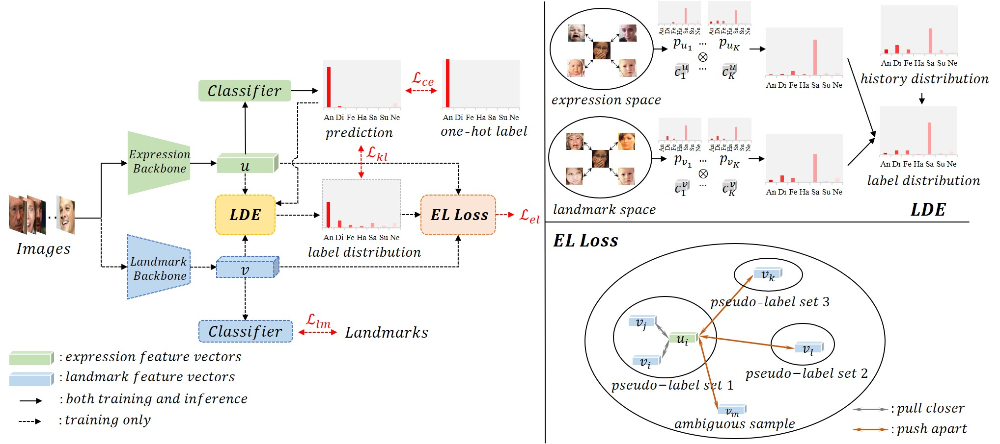
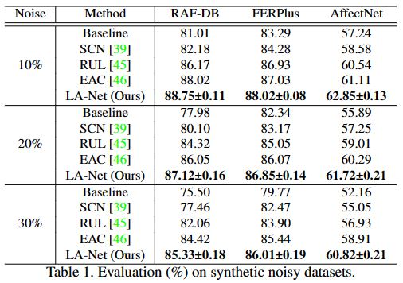
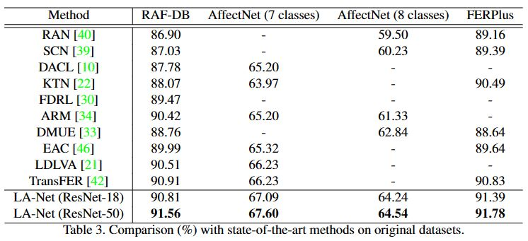
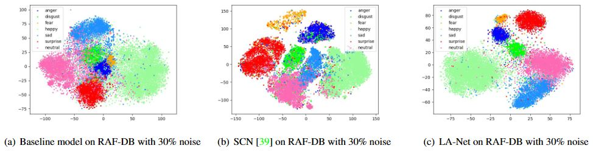

## LA-Net: Landmark-Aware Learning for Reliable Facial Expression Recognition under Label Noise 



Official implementation of the ICCV 2023 paper:  LA-Net: Landmark-Aware Learning for Reliable Facial Expression Recognition under Label Noise 

### Abstract

Facial expression recognition (FER) remains a challenging task due to the ambiguity of expressions. The derived noisy labels significantly harm the performance in real-world scenarios. To address this issue, we present a new FER model named Landmark-Aware Net~(LA-Net), which leverages facial landmarks to mitigate the impact of label noise from two perspectives. Firstly, LA-Net uses landmark information to suppress the uncertainty in expression space and constructs the label distribution of each sample by neighborhood aggregation, which in turn improves the quality of training supervision. Secondly, the model incorporates landmark information into expression representations using the devised expression-landmark contrastive loss. The enhanced expression feature extractor can be less susceptible to label noise. Our method can be integrated with any deep neural network for better training supervision without introducing extra inference costs. We conduct extensive experiments on both in-the-wild datasets and synthetic noisy datasets and demonstrate that LA-Net achieves state-of-the-art performance.

### Train

We provide the pytorch code as an example. Please download the RAF-DB dataset from [Real-world Affective Faces (RAF) Database (whdeng.cn)](http://www.whdeng.cn/raf/model1.html) and put it under the folder: *./RAF_DB*

we provide the pre-detected facial landmarks in the *./Model_Data* folder. Note that the landmarks are actually not used in inference.

Put your pretrained model in the *./Model_Data* folder. For example: *./Model_Data/resnet-18.pth*

Train LA-Net with clean labels (2 GPUs for example):

```
CUDA_VISIBLE_DEVICES=0,1 python -m torch.distributed.launch --nproc_per_node=2 --master_port=54325 train.py 
```

Train LA-Net with 10% noise labels (2 GPUs for example):

```
CUDA_VISIBLE_DEVICES=0,1 python -m torch.distributed.launch --nproc_per_node=2 --master_port=54325 train.py --noise_ratio=0.1
```

### Results

#### Performance on datasets with synthetic noise (symmetric noise)



#### Performance on original datasets



#### T-SNE visualization


